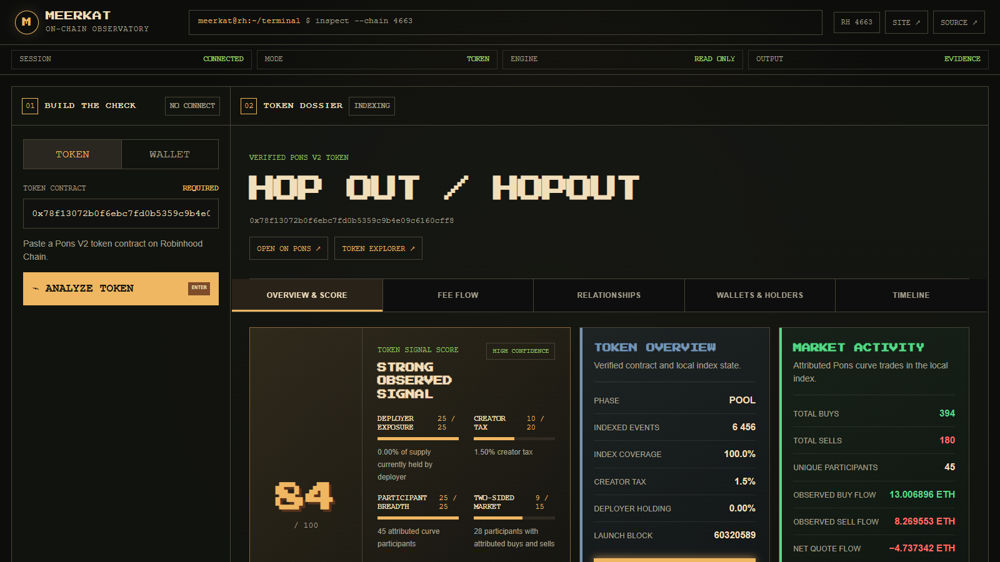
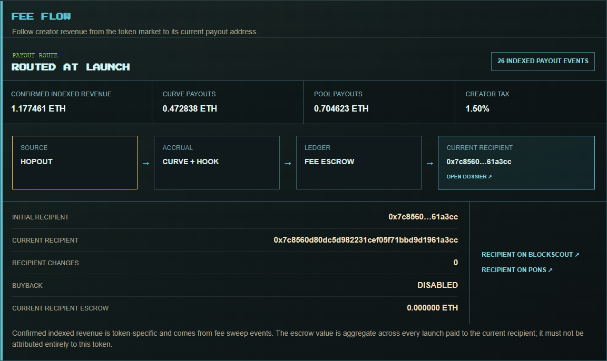
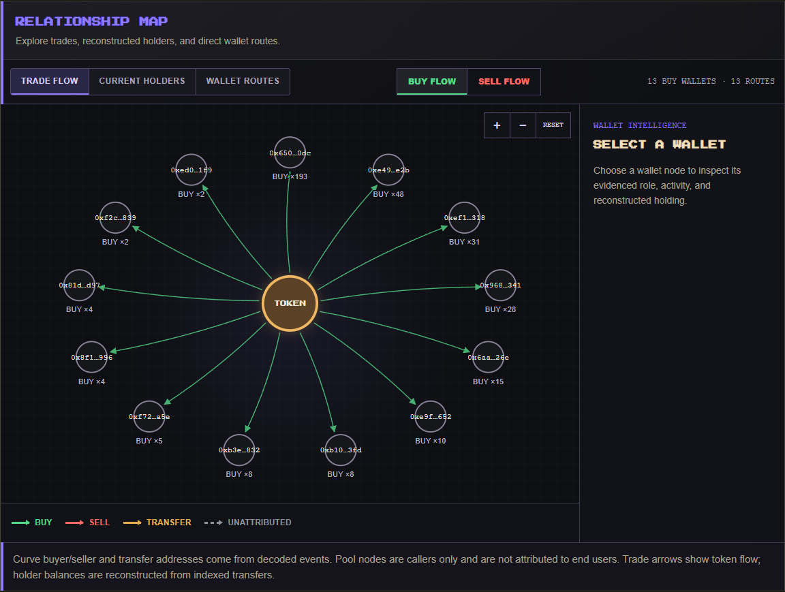
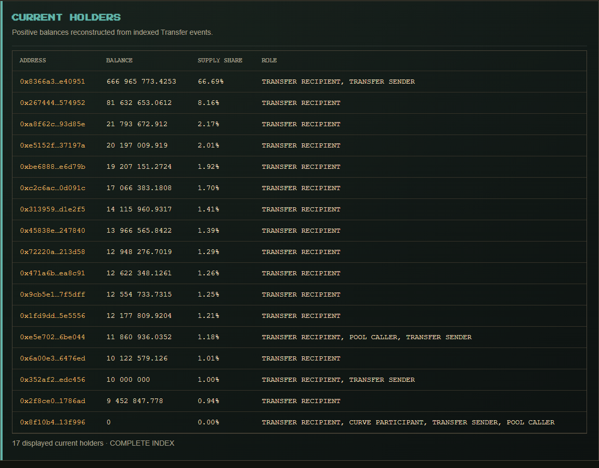
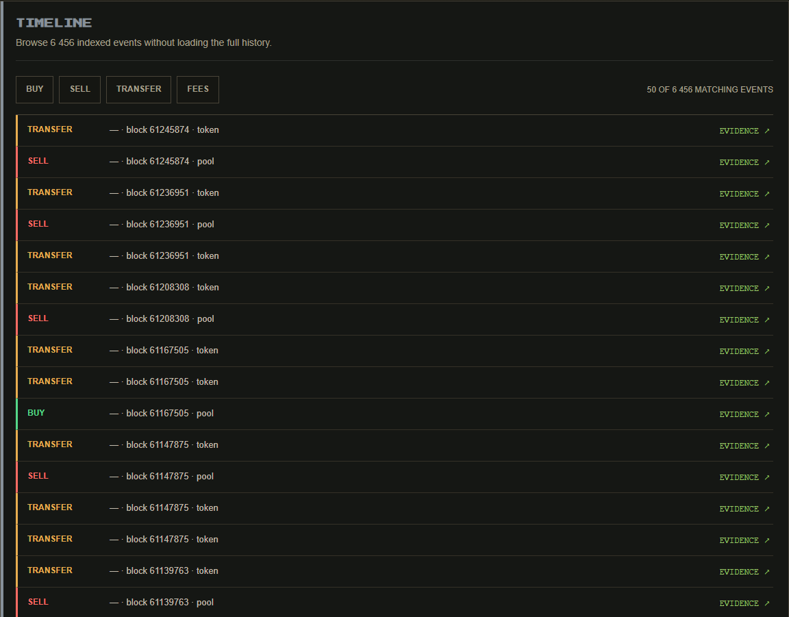
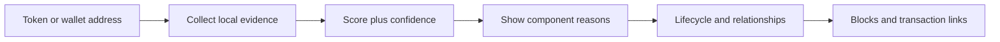

<p align="center">
  
</p>

<h1 align="center">MEERKAT</h1>

<p align="center"><strong>Score a token. Score a wallet. Open the evidence behind every point.</strong></p>

<p align="center">
  Local token intelligence for Pons V2 on Robinhood Chain.<br>
  No private key. No signer. No transaction path.
</p>

<p align="center">
  <a href="docs/PRODUCT.md">Product</a> ·
  <a href="docs/ANALYSIS.md">How analysis works</a> ·
  <a href="docs/ARCHITECTURE.md">Architecture</a> ·
  <a href="ROADMAP.md">Roadmap</a> ·
  <a href="docs/TOKEN.md">Token status</a> ·
  <a href="docs/LOCAL-SETUP.md">Run locally</a> ·
  <a href="SECURITY.md">Security</a>
</p>

<p align="center"><sub>Developed with assistance from <a href="https://claude.ai/">Claude</a> and <a href="https://openai.com/codex/">OpenAI Codex</a>.</sub></p>

> **Project status:** transparent token scoring, local wallet scoring, lifecycle reconstruction and the relationship map work locally today. Wallet coverage is limited to histories indexed by that installation. A hosted public terminal and a MEERKAT token have not launched.

## What it looks like

**Score first, then inspect the reasons.** The Overview keeps the token score, confidence, index coverage, market activity and source links in one workspace. This capture uses the real HOP OUT token on Robinhood Chain.

<p align="center">
  
</p>

**Follow creator revenue to its current recipient.** Fee Flow separates curve payouts from pool payouts, reconstructs routing changes and links the recipient to its wallet dossier, Pons profile and Blockscout evidence.



**See who interacted with the token and in which direction.** Relationship Map separates BUY and SELL flows, current holders and direct wallet routes. Every wallet node opens the observed activity behind it.



| Reconstructed current holders | Paginated lifecycle evidence |
| --- | --- |
| Balances and supply shares come from indexed ERC-20 transfers and remain marked partial until the captured head is complete. | Timeline loads 50 events at a time, colors BUY and SELL separately and links every row to its transaction. |
|  |  |

## What MEERKAT does

Paste a Pons V2 token or public wallet address into `/terminal`. MEERKAT returns a 0–100 evidence score first, shows confidence and every scoring component, then opens the underlying dossier:

- launch identity, deployer, pair, curve, tax and current phase;
- curve buys and sells with attributed initiating addresses;
- factory phase transitions, pool swaps and ERC-20 transfers;
- exact block, transaction, log index, quantities and venue for every event;
- participant summaries such as early entry and fast exit, with the rule shown;
- token score components for deployer exposure, creator tax, participant breadth, two-sided market activity and reconstructed current-holder breadth;
- wallet score components for local scope, early discovery, two-sided activity and evidence depth;
- exact creator-fee flow from curve and pool sweep events, including the current recipient and recipient-change history;
- three relationship views: directional trade flow, reconstructed current holders and direct wallet-to-wallet transfer routes;
- a wallet inspector on every graph node with observed roles, buys, sells, token amounts, current reconstructed balance and supply share;
- a wallet dossier across every token history stored on the same installation.

Token evidence is split into five persistent views: **Overview & Score**, **Fee Flow**, **Relationships**, **Wallets & Holders**, and **Timeline**. The Timeline loads only when opened, fetches 50 newest events at a time, and can filter BUY, SELL, TRANSFER, and FEES evidence without placing the complete history in the browser.

BUY evidence is green, SELL evidence is red, transfers are amber and unattributed activity is gray throughout the terminal. Trade Flow can isolate BUY or SELL wallets and places them around the token; Current Holders and Wallet Routes show each displayed wallet's indexed buy/sell counts. Missing evidence lowers the score's confidence and remains visible. Holder balances are reconstructed from indexed ERC-20 Transfer events; while an index is incomplete, the holder view is explicitly marked partial. A score is a summary of observed evidence, not a safety rating, price prediction, beneficial-ownership claim, realized profit, bot identity, or investment-skill verdict.

## Run it

Requires **Node.js 24** and a Robinhood Chain RPC endpoint.

```sh
git clone https://github.com/kocer6/MEERKAT.git
cd MEERKAT
npm ci
npm start
```

Open [http://127.0.0.1:4664/](http://127.0.0.1:4664/), select **Open terminal**, and paste a token or wallet address. The default RPC and database path work without adding secrets. See the [local setup guide](docs/LOCAL-SETUP.md) for configuration and troubleshooting.

## Two investigation modes

| Mode | Input | Result | Current boundary |
| --- | --- | --- | --- |
| **Token** | Pons V2 token address | Five focused views for score, fee flow, relationships, holders and lifecycle evidence | Timeline pages load 50 events at a time; the full indexed history stays in SQLite |
| **Wallet** | Public EVM address | Behavior score, confidence, cross-token activity and timing labels | Searches locally indexed Pons histories; global wallet discovery is in development |

The landing page, terminal, APIs, indexer, state, and database all run inside one local Node.js process. The browser never receives a signing route because the server has none.

## Verified evidence

The current checkpoint was exercised against Robinhood Chain using COPY (`0xac79255f6f404eba14f316e8669d76573a2d7b1e`):

- factory launch resolved at block `59,283,454`;
- an interrupted job resumed from its saved profile and 64-block overlap;
- the captured head `60,319,607` completed with `41,302` persisted events;
- `25` curve participants were attributed and the bounded relationship API returned `48` nodes and `96` routes.

This is evidence for one real token and captured head, not a claim that every token is fully indexed. Reproduction details and known limits are in the [full backfill note](docs/evidence/copy-backfill-relationship-2026-09-11.md).

The dense ZZZ token (`0x7dbf38976f6d3b9c529e7d9484a71898b409ee6a`) was also opened through the packaged terminal. At the completed captured head, MEERKAT loaded `741,643` persisted events, `29` attributed curve participants, a transparent `93/100` token score, and `16` displayed reconstructed holders. Wallet Routes rendered transfer evidence only. The live head continues to advance, so a refresh can temporarily return the score to `CALIBRATING` while the new tail is indexed.

HOP OUT (`0x78f13072b0f6ebc7fd0b5359c9b4e09c6160cff8`) verified the creator-fee path at captured head `60,571,478`: `26` token-specific sweep events paid `1.177461500182357592 ETH` in total, split between `0.472838185133738444 ETH` from the curve and `0.704623315048619148 ETH` from the pool. The configured recipient differs from the deployer, so the terminal labels the route `ROUTED AT LAUNCH`. The recipient escrow balance is displayed separately because it aggregates assets across launches and is not this token's revenue.

## How an address becomes evidence



Every label is derived from an explicit rule. For example, an **early entry** is a curve buy within 30 blocks of launch, and a **fast exit** is a sell within 300 blocks of that wallet's first indexed buy. Read the complete [analysis contract](docs/ANALYSIS.md).

## Roadmap

| Stage | Status | Acceptance gate |
| --- | --- | --- |
| Token signal score | **Live locally** | Withheld until ready; deterministic components and confidence |
| Local wallet score | **Live locally** | Cross-token local evidence with explicit coverage |
| Token lifecycle | **Live locally** | Verified launch and resumable event history |
| Global wallet discovery | **Building** | Bounded discovery with saved cursor |
| Relationship map | **Live locally** | Trade Flow, Current Holders and Wallet Routes with a selected-wallet inspector |
| Creator fee flow | **Live locally** | Exact curve/pool sweeps, current route and recipient-change evidence |
| Holder intelligence | **Live locally / improving** | Transfer-ledger balances and explicit partial state; known-contract exclusions remain next |
| Pons market context | **Next** | Official-source freshness and independent timestamp gates |
| Cases and alerts | **Next** | Saved investigations and local rule notifications |
| Read-only API and exports | **Planned** | Versioned schema and portable evidence bundle |
| Hosted terminal / more chains | **Later** | Operational and adapter validation before public claims |

The detailed [public roadmap](ROADMAP.md) separates shipped behavior from future work and defines the evidence required to change each status.

## Documentation

| Document | Use it for |
| --- | --- |
| [Product guide](docs/PRODUCT.md) | What the terminal is for and how an investigation flows |
| [Analysis contract](docs/ANALYSIS.md) | Events, labels, attribution, scoring boundaries and data gaps |
| [Architecture](docs/ARCHITECTURE.md) | Components, persistence, APIs and trust boundaries |
| [Local setup](docs/LOCAL-SETUP.md) | Install, configure, update, back up and troubleshoot |
| [Roadmap](ROADMAP.md) | Shipped, current, next and later work with acceptance gates |
| [Token status](docs/TOKEN.md) | Official launch status and verification policy |
| [Security policy](SECURITY.md) | Read-only model and responsible reporting |
| [Contributing](CONTRIBUTING.md) | Development workflow and pull request checks |
| [Technical handoff](HANDOFF.md) | Exact current checkpoint, commands and known limits |
| [Third-party notices](THIRD_PARTY_NOTICES.md) | Imported code and asset provenance |

The full COPY backfill and restart evidence is recorded in the [lifecycle checkpoint](docs/evidence/copy-backfill-relationship-2026-09-11.md).
Dense-token recovery above the RPC's 10,000-log limit is recorded in the [ZZZ checkpoint](docs/evidence/zzz-dense-index-2026-09-11.md).

## Development checks

```sh
npm run typecheck
npm test
npm run build
npm run start:built
```

MEERKAT is early software. Verify important conclusions against the linked transaction evidence and never treat a behavior label as financial advice.
