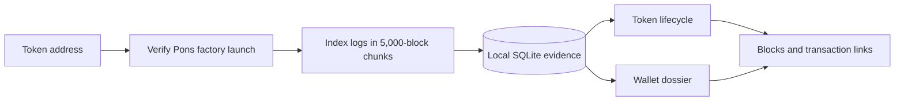

<p align="center">
  
</p>

<h1 align="center">MEERKAT</h1>

<p align="center"><strong>Reconstruct a token's life. Read a wallet's behavior. Keep the evidence.</strong></p>

<p align="center">
  Local token intelligence for Pons V2 on Robinhood Chain.<br>
  No private key. No signer. No transaction path.
</p>

<p align="center">
  <a href="docs/PRODUCT.md">Product</a> ·
  <a href="docs/ANALYSIS.md">How analysis works</a> ·
  <a href="docs/ARCHITECTURE.md">Architecture</a> ·
  <a href="ROADMAP.md">Roadmap</a> ·
  <a href="docs/TOKEN.md">Token status</a> ·
  <a href="docs/LOCAL-SETUP.md">Run locally</a> ·
  <a href="SECURITY.md">Security</a>
</p>

> **Project status:** the local token lifecycle indexer and terminal work today. Wallet analysis is real but limited to token histories indexed by that installation. A hosted public terminal and a MEERKAT token have not launched.

## What MEERKAT does

Paste a Pons V2 token address into `/terminal`. MEERKAT verifies its factory launch, walks the chain in durable chunks, and builds a local evidence trail across its indexed lifecycle:

- launch identity, deployer, pair, curve, tax and current phase;
- curve buys and sells with attributed initiating addresses;
- factory phase transitions, pool swaps and ERC-20 transfers;
- exact block, transaction, log index, quantities and venue for every event;
- participant summaries such as early entry and fast exit, with the rule shown;
- a wallet dossier across every token history stored on the same installation.

MEERKAT does not turn missing evidence into a score. It does not claim beneficial ownership, realized profit, bot identity, or investment skill.

## Run it

Requires **Node.js 24** and a Robinhood Chain RPC endpoint.

```sh
git clone https://github.com/kocer6/MEERKAT.git
cd MEERKAT
npm ci
npm start
```

Open [http://127.0.0.1:4664/](http://127.0.0.1:4664/), select **Open terminal**, and paste a token or wallet address. The default RPC and database path work without adding secrets. See the [local setup guide](docs/LOCAL-SETUP.md) for configuration and troubleshooting.

## Two investigation modes

| Mode | Input | Result | Current boundary |
| --- | --- | --- | --- |
| **Token** | Pons V2 token address | Verified profile, lifecycle, actors, wallet summaries and transaction evidence | Latest 500 events are rendered; the full indexed history stays in SQLite |
| **Wallet** | Public EVM address | Cross-token buys, sells, transfers and timing labels | Searches locally indexed Pons histories; global wallet discovery is in development |

The landing page, terminal, APIs, indexer, state, and database all run inside one local Node.js process. The browser never receives a signing route because the server has none.

## Verified evidence

The current checkpoint was exercised against Robinhood Chain using COPY (`0xac79255f6f404eba14f316e8669d76573a2d7b1e`):

- factory launch resolved at block `59,283,454`;
- the first `5,000`-block chunk returned `3,170` lifecycle events;
- `25` curve participants were attributed from buy/sell events;
- the chunk persisted locally and can resume with overlap after interruption.

This is a bounded integration sample, not a claim that every token is fully indexed. Reproduction details and known limits are in the [evidence note](docs/evidence/landing-terminal-v1-2026-09-11.md).

## How an address becomes evidence



Every label is derived from an explicit rule. For example, an **early entry** is a curve buy within 30 blocks of launch, and a **fast exit** is a sell within 300 blocks of that wallet's first indexed buy. Read the complete [analysis contract](docs/ANALYSIS.md).

## Roadmap

| Stage | Status | Acceptance gate |
| --- | --- | --- |
| Token lifecycle | **Live locally** | Verified launch and resumable event history |
| Wallet dossiers | **Building** | Global bounded discovery with saved cursor |
| Relationship map | **Next** | Visual actor routes without invented ownership links |
| Cases and alerts | **Next** | Saved investigations and local rule notifications |
| Read-only API and exports | **Planned** | Versioned schema and portable evidence bundle |
| Hosted terminal / more chains | **Later** | Operational and adapter validation before public claims |

The detailed [public roadmap](ROADMAP.md) separates shipped behavior from future work and defines the evidence required to change each status.

## Documentation

| Document | Use it for |
| --- | --- |
| [Product guide](docs/PRODUCT.md) | What the terminal is for and how an investigation flows |
| [Analysis contract](docs/ANALYSIS.md) | Events, labels, attribution, scoring boundaries and data gaps |
| [Architecture](docs/ARCHITECTURE.md) | Components, persistence, APIs and trust boundaries |
| [Local setup](docs/LOCAL-SETUP.md) | Install, configure, update, back up and troubleshoot |
| [Roadmap](ROADMAP.md) | Shipped, current, next and later work with acceptance gates |
| [Token status](docs/TOKEN.md) | Official launch status and verification policy |
| [Security policy](SECURITY.md) | Read-only model and responsible reporting |
| [Contributing](CONTRIBUTING.md) | Development workflow and pull request checks |
| [Technical handoff](HANDOFF.md) | Exact current checkpoint, commands and known limits |
| [Third-party notices](THIRD_PARTY_NOTICES.md) | Imported code and asset provenance |

## Development checks

```sh
npm run typecheck
npm test
npm run build
npm run start:built
```

MEERKAT is early software. Verify important conclusions against the linked transaction evidence and never treat a behavior label as financial advice.
