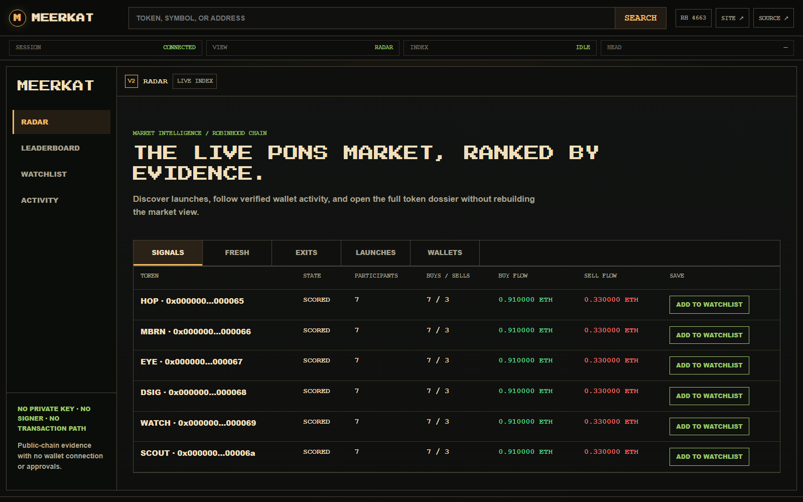

# MEERKAT public roadmap

This roadmap records product capability, not marketing dates. A feature moves to **Live** only after its acceptance gate is demonstrated in the repository and, where relevant, on the hosted terminal.

## Live

### Radar V2 market workspace

- continuously discovers verified Pons launches with one server-owned worker;
- serves Signals, Fresh, Exits, Launches, and Wallets from cached SQLite state;
- replaces the separate Analyze screen with global name, symbol, token, and wallet search;
- connects token and wallet dossiers, browser watchlist, material Activity, and an evidence-gated PnL leaderboard;
- stores weighted-average positions and captures executable pair-token quotes for open PnL when available.

Acceptance evidence: deterministic index, position, score, search, ranking, route, and restart tests plus the QA record in `docs/evidence/radar-v2-2026-09-14.md`.

### Transparent scores

- withholds the token score until indexing completes, then scores deployer exposure, creator tax, participant breadth, two-sided activity and holder breadth;
- returns a wallet behavior score from local scope, early discovery, two-sided activity and evidence depth;
- shows every component, observation, caveat and confidence level before the detailed dossier;
- keeps PnL unknown when attribution, transfer continuity, or executable quote evidence is incomplete.

Acceptance evidence: deterministic scoring tests for strong, partial and thin-evidence cases plus UI/API contract checks.

### Token lifecycle indexer

- verifies a Pons V2 launch from the factory event;
- reads curve trades, phase events, native ETH pool swaps and token transfers;
- persists 5,000-block chunks and resumes with reorg overlap;
- keeps exact block, transaction, log and decoded evidence;
- summarizes attributed curve participants without claiming identity or profit.

Acceptance evidence: tests, build, browser QA, and the bounded COPY integration sample recorded in `docs/evidence/landing-terminal-v1-2026-09-11.md`.

### Connected terminal shell

- branded public landing page with a compact interactive ZZZ dossier preview, five working evidence tabs and a direct ZZZ analysis route;
- Radar, Leaderboard, Watchlist, and Activity destinations plus route-addressable token and wallet dossiers;
- global search with explicit wallet fallback for unclassified addresses;
- lazy Timeline pages of 50 events with BUY, SELL, TRANSFER and FEES filters;
- BUY/SELL-specific radial Trade Flow views and per-wallet trade counts in holder and transfer-route maps;
- local SQLite persistence;
- no signer or transaction route.

### Hosted public terminal

- live at [meerkat.my](https://meerkat.my/terminal) behind automatic HTTPS;
- bounds public indexing through per-client admission limits and a global work queue;
- keeps operator routes unavailable from the public surface;
- persists index cursors in SQLite and resumes an interrupted token after restart;
- creates scheduled online backups with a tested SQLite recovery check.

Acceptance evidence: the DNS, TLS, restart, HOP OUT resume and backup checks in `docs/evidence/public-deployment-2026-09-13.md`.

### Relationship map

- aggregates deployer, curve participants, transfer routes and pool callers from persisted evidence;
- separates attributed BUY and SELL flows around the token and exposes buy/sell counts on wallet nodes;
- distinguishes event addresses from pool-caller-only routes;
- bounds large histories to 48 nodes / 96 routes and shows the top 18 nodes in the browser;
- opens a local wallet dossier from an address node.

The shipped map keeps BUY and SELL investigations separate, places the observed wallets around the token and opens the evidence behind a selected address.

The full COPY checkpoint reached the captured head after an interrupted restart. Exact results are recorded in `docs/evidence/copy-backfill-relationship-2026-09-11.md`.

### Creator fee flow

- totals exact creator amounts from curve and pool fee sweep events;
- distinguishes a direct deployer route, a recipient selected at launch and a later redirect;
- reconstructs completed and pending recipient changes;
- keeps the recipient escrow balance separate from token-specific revenue;
- links the current recipient to its local dossier, Pons profile and Blockscout address page.

Acceptance evidence: deterministic aggregation and migration tests plus the real HOP OUT checkpoint in `docs/evidence/hop-out-fee-flow-2026-09-11.md`.

## Building now

### Broader outcome coverage

- expand historical outcomes beyond the recent Radar window;
- classify additional known infrastructure contracts;
- compare captured executable quotes against independent Pons views;
- add explicit stale-age controls to ranked feeds.

## Next

### Token holder intelligence

Reconstruct current balances from the complete transfer ledger, separate known protocol contracts, and show top-holder concentration with exact last-changing transactions. Unknown contract roles must remain marked rather than treated as people.

Acceptance gate: balance conservation fixtures, known-protocol exclusions, a real-token comparison against the Pons holder view, and explicit coverage at the captured head.

### Pons market context

Show current Pons price, market cap, quote asset and market phase beside the on-chain score. Market data remains a separate timestamped input and cannot silently change the deterministic evidence score.

Acceptance gate: documented official source, cache/timeout behavior, stale label, and a real-token comparison against `ponsfamily.com`.

### Saved cases and alerts

Let users save a token or wallet investigation, attach local notes, and define local rules for new evidence. Alert delivery must preserve the triggering block/transaction and survive restart.

### Evidence export

Export a portable JSON bundle containing the input, chain/deployment identity, coverage, profiles, events, labels, rule versions, and generation time. Add a human-readable report after the schema is stable.

### Index operations

Expose estimated remaining blocks, captured-head age, manual refresh and per-source RPC failures. Dense log ranges must split automatically and interrupted work must resume from the last durable checkpoint.

Acceptance gate: dense-token fixture above the provider log limit, restart proof, and browser status that never presents an incomplete score as final.

## Planned

### Versioned evidence API

Publish stable schemas for the existing token summary, paginated timeline and wallet dossier endpoints, then add case and evidence-export endpoints.

### Comparative wallet cohorts

After global wallet discovery exists, compare a wallet only with wallets that had similar token opportunity sets and observation windows. Publish cohort size and methodology with every percentile.

Acceptance gate: reproducible cohort fixtures, minimum sample thresholds, address-splitting limitations, and no profitability label without outcome accounting.

## Later

- additional Pons pair types after source adapters and quantity semantics are validated;
- additional chains after deployment/ABI provenance and integration fixtures exist;
- comparative wallet cohorts after global discovery and outcome methodology are defensible.

## Product boundary

MEERKAT will remain useful without wallet connection or token ownership. No roadmap item requires custody, a private key, transaction signing, or gated access to the base evidence terminal.
