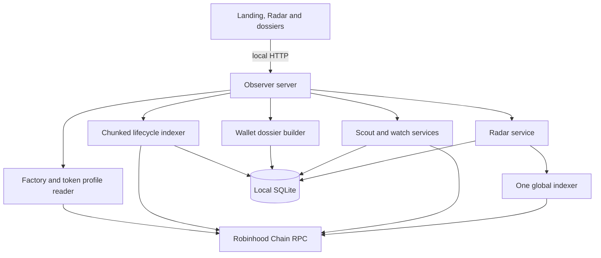

# Architecture

MEERKAT runs as one local Node.js 24 process. It serves the website and terminal, reads Robinhood Chain through JSON-RPC, indexes evidence, and stores state in SQLite.

The same process can run in public mode behind a loopback reverse proxy. Public mode removes the browser control token, exposes bounded token-index admission, adds a SQLite health endpoint, and hides local watch, monitor, scanner, state, and export routes. The production topology and operations are documented in [Public deployment](DEPLOYMENT.md).

## Runtime components

| Component | Main source | Responsibility |
| --- | --- | --- |
| CLI | `src/cli.ts` | Starts the active observer product server |
| Observer server | `src/observer-server.ts` | Static routes and local evidence APIs |
| Token history | `src/token-history.ts` | Profile verification, chunk reads, persistence and participant summaries |
| Relationship graph | `src/relationship-graph.ts` | Bounded role/route aggregation with explicit attribution level |
| Wallet dossier | `src/wallet-dossier.ts` | Cross-token aggregation over local histories |
| Score model | `src/scoring.ts` | Deterministic components, confidence and caveats |
| Discovery | `src/discovery.ts` | Recent Pons launch discovery used by Live Scout |
| Watch service | `src/watch.ts` | Local watchlist, snapshots and activity |
| Chain adapters | `src/chain/*` | Selected Pons ABI, market reads and quote math |
| Radar indexer | `src/radar/indexer.ts` | One coalesced launch/trade worker with independent factory and market cursors |
| Radar service | `src/radar/service.ts` | Cached feeds, global search, connected summaries, activity, watchlist and leaderboard queries |
| Position accounting | `src/radar/positions.ts` | Weighted-average cost, realized PnL, executable open-position marks and transfer-gap handling |
| Radar scores | `src/radar/scores.ts` | Separate Launch Quality, Wallet Reputation and Radar Strength models |

The older paper-trading modules remain in the repository as tested development history, but the default `npm start` product uses `observer-server.ts` and exposes no order or signing service.

## Persistence

The default database is `data/observer.sqlite`. SQLite WAL mode and a busy timeout are enabled. Token history uses two logical tables:

- `token_history`: profile, cursor, state, error and update time per token;
- `token_events`: decoded evidence keyed by token and stable event identity.

Radar adds `radar_cursors`, `radar_launches`, `radar_events`, `wallet_token_positions`, `wallet_outcomes`, `wallet_scores`, `token_signal_snapshots`, `radar_activity`, and `watchlist_items` in the same database. Factory and market cursors persist independently. Database files and SQLite companions are ignored by Git. Back up the process while stopped, or copy the database together with its WAL/SHM companions.

## Indexing and resume

The history reader verifies one factory launch event, captures the current head, and requests logs in 5,000-block chunks. Each successful chunk and its cursor commit in one SQLite transaction. A resumed job starts with a 64-block overlap, replacing events in the overlap before writing the new result. At most two token-history jobs run at once.

Interrupted/error jobs reuse the already verified saved profile and captured head. This avoids repeating the expensive genesis-to-head launch lookup during recovery. A completed `ready` history performs a fresh profile/head read when the user explicitly refreshes it.

RPC rate-limit retries are bounded. Transfer history probes each token for log density: dense ranges use ordered 10,000-block windows with concurrency capped at two, while sparse ranges keep the wider adaptive request. Failure changes the state to `error`; it does not erase already committed chunks or silently switch data sources.

While a backfill is active, `/api/token/history` returns state, cursor, remaining ranges and an indexed event count without loading every event into a score/graph worker. Timeline pages remain available from persisted rows. The complete score, fee flow, holders and relationship graph are built when the captured head is ready.

## Local APIs

The current browser uses:

| Endpoint | Purpose |
| --- | --- |
| `GET /api/token/history?token=…` | Read profile, cursor, latest events and wallet summaries |
| `POST /api/token/index?token=…` | Start/resume local indexing for a token |
| `GET /api/wallet/dossier?address=…` | Aggregate a wallet over locally indexed histories |
| `GET /api/state` | Read Scout, watch and local activity state |
| `GET /api/export` | Download local observation state |
| `POST /api/watch/*`, `/api/monitor/*`, `/api/scanner/*` | Operate local supporting tools |
| `GET /api/radar/status` | Read the single global worker state, cursors and lag |
| `GET /api/radar/signals?feed=…&window=…` | Read bounded cached Radar feeds without chain calls |
| `GET /api/radar/search?q=…` | Classify a token/name/symbol or request explicit wallet fallback |
| `GET /api/radar/token/:address/summary` | Read cached scores, positions, events and launch identity |
| `GET /api/radar/wallet/:address/summary` | Read reputation, eligibility, outcomes, positions and PnL |
| `GET /api/radar/leaderboard` | Rank eligible and provisional wallets deterministically |
| `GET /api/radar/activity` | Read material indexed changes |

`MEERKAT_RADAR=0` disables the background worker for controlled QA or maintenance. `MEERKAT_RPC_URL` selects the Robinhood Chain RPC, `MEERKAT_DB` selects the SQLite path, and `PORT` selects the HTTP port. `MEERKAT_RADAR_START_BLOCK` optionally sets a trusted lower scan floor; bootstrap validates factory bytecode at the current head so it also works with a non-archive RPC. With Radar enabled, browser GET requests never initiate chain reads; the single process worker owns discovery and market indexing. Every restart resumes each cursor with a 64-block replacement overlap.

These endpoints are not yet a versioned public API. Their schemas may change before the roadmap API gate is complete.

In public mode, only token history, token timeline, wallet dossier, bounded token-index admission, and `/healthz` are exposed. The local operator endpoints above return `404`.

## Trust boundary

MEERKAT trusts the configured RPC to return canonical chain data and shows exact transaction evidence so important findings can be verified elsewhere. It accepts public addresses only. The active process does not read a private-key environment variable, construct calldata, sign messages, or broadcast transactions.
