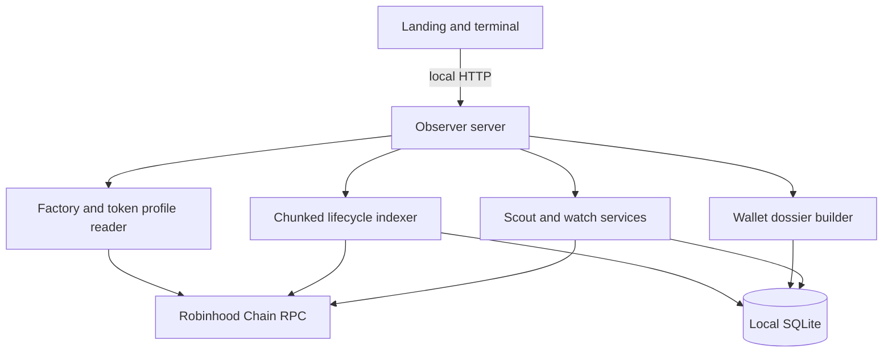

# Architecture

MEERKAT runs as one local Node.js 24 process. It serves the website and terminal, reads Robinhood Chain through JSON-RPC, indexes evidence, and stores state in SQLite.

## Runtime components

| Component | Main source | Responsibility |
| --- | --- | --- |
| CLI | `src/cli.ts` | Starts the active observer product server |
| Observer server | `src/observer-server.ts` | Static routes and local read-only APIs |
| Token history | `src/token-history.ts` | Profile verification, chunk reads, persistence and participant summaries |
| Relationship graph | `src/relationship-graph.ts` | Bounded role/route aggregation with explicit attribution level |
| Wallet dossier | `src/wallet-dossier.ts` | Cross-token aggregation over local histories |
| Score model | `src/scoring.ts` | Deterministic components, confidence and caveats |
| Discovery | `src/discovery.ts` | Recent Pons launch discovery used by Live Scout |
| Watch service | `src/watch.ts` | Local watchlist, snapshots and activity |
| Chain adapters | `src/chain/*` | Selected Pons ABI, market reads and quote math |

The older paper-trading modules remain in the repository as tested development history, but the default `npm start` product uses `observer-server.ts` and exposes no order or signing service.

## Persistence

The default database is `data/observer.sqlite`. SQLite WAL mode and a busy timeout are enabled. Token history uses two logical tables:

- `token_history`: profile, cursor, state, error and update time per token;
- `token_events`: decoded evidence keyed by token and stable event identity.

Watch and discovery state use tables in the same local database. Database files and SQLite companions are ignored by Git. Back up the process while stopped, or copy the database together with its WAL/SHM companions.

## Indexing and resume

The history reader verifies one factory launch event, captures the current head, and requests logs in 5,000-block chunks. Each successful chunk and its cursor commit in one SQLite transaction. A resumed job starts with a 64-block overlap, replacing events in the overlap before writing the new result. At most two token-history jobs run at once.

Interrupted/error jobs reuse the already verified saved profile and captured head. This avoids repeating the expensive genesis-to-head launch lookup during recovery. A completed `ready` history performs a fresh profile/head read when the user explicitly refreshes it.

RPC rate-limit retries are bounded. Failure changes the state to `error`; it does not erase already committed chunks or silently switch data sources.

## Local APIs

The current browser uses:

| Endpoint | Purpose |
| --- | --- |
| `GET /api/token/history?token=…` | Read profile, cursor, latest events and wallet summaries |
| `POST /api/token/index?token=…` | Start/resume local indexing for a token |
| `GET /api/wallet/dossier?address=…` | Aggregate a wallet over locally indexed histories |
| `GET /api/state` | Read Scout, watch and local activity state |
| `GET /api/export` | Download local observation state |
| `POST /api/watch/*`, `/api/monitor/*`, `/api/scanner/*` | Operate local supporting tools |

These endpoints are not yet a versioned public API. Their schemas may change before the roadmap API gate is complete.

## Trust boundary

MEERKAT trusts the configured RPC to return canonical chain data and shows exact transaction evidence so important findings can be verified elsewhere. It accepts public addresses only. The active process does not read a private-key environment variable, construct calldata, sign messages, or broadcast transactions.
