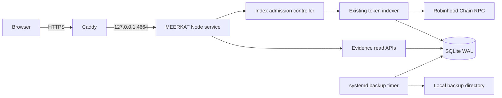

# MEERKAT public deployment design

Date: 2026-09-13  
Target: `meerkat.my` on the XorekCloud VPS at `2.26.61.52`

## Objective

Publish the existing MEERKAT landing page and evidence terminal as a durable public service. A visitor can inspect a Pons V2 token or a wallet without an account. The deployment must preserve the product contract: MEERKAT accepts public addresses, reads public chain evidence, and has no private key, signer, approval, or transaction path.

The first public release uses one VPS and one SQLite database. It does not add distributed workers, user accounts, payments, or a second database.

## Current constraints

The current server is intentionally local:

- it binds to `127.0.0.1` and trusts only its generated local URL as `Host` and `Origin`;
- it embeds a process-wide control token in terminal HTML;
- that token authorizes indexing as well as watchlist, scanner, and monitor mutations;
- the default SQLite file lives inside the checkout;
- there is no reverse proxy, TLS termination, public request limiting, health endpoint, deployment service, or backup schedule.

Serving the current process directly on a public interface would expose local controls and allow unbounded indexing requests. The public release therefore changes the HTTP trust boundary before DNS is pointed at the VPS.

## Considered approaches

### Recommended: one application behind Caddy

Caddy owns ports 80 and 443. MEERKAT continues to listen on loopback and distinguishes public analysis actions from operator controls. A small in-process admission controller deduplicates and rate-limits indexing jobs.

This approach fits the two-day launch window, keeps the existing one-process architecture, and preserves SQLite. It has fewer failure modes than adding Redis or a separate API service.

### Static landing plus private terminal

The landing could be hosted separately while the terminal stayed local. This would be simpler to secure but would fail the approved product goal: visitors must be able to paste an address and receive a live analysis.

### Separate web and worker services

A public web process could enqueue work for dedicated workers through Redis or PostgreSQL. This scales further but adds infrastructure, operational cost, and recovery paths that are unnecessary for the initial release.

## Runtime architecture

The production process runs as an unprivileged `meerkat` system user. The checkout is stored at `/opt/meerkat/app`; mutable data is stored at `/var/lib/meerkat`; environment configuration is stored at `/etc/meerkat/meerkat.env`; backups are stored at `/var/backups/meerkat`. Only Caddy is reachable from the public network.

## Application configuration

`startObserver` gains explicit deployment configuration while preserving local defaults:

| Setting | Local default | Production value |
| --- | --- | --- |
| bind host | `127.0.0.1` | `127.0.0.1` |
| port | `4664` | `4664` |
| public origin | generated local URL | `https://meerkat.my` |
| trusted hosts | generated local host | `meerkat.my`, `www.meerkat.my` |
| public mode | disabled | enabled |
| database | `data/observer.sqlite` | `/var/lib/meerkat/observer.sqlite` |
| maximum active index jobs | existing indexer cap | `2` |

The production environment contains no wallet secret. The repository and systemd unit must not define or read a private key.

## HTTP trust boundary

### Public routes

The following routes are available without a secret:

- static landing, terminal, styles, scripts, fonts, and images;
- `GET /healthz` with a bounded response containing service status only;
- `GET /api/token/history`;
- `GET /api/token/timeline`;
- `GET /api/wallet/dossier`;
- `POST /api/token/index` through the admission controller.

The browser no longer receives a control token. The terminal calls `POST /api/token/index` without an administrative header.

### Operator-only routes

`/api/state`, `/api/export`, `/api/watch/*`, `/api/monitor/*`, and `/api/scanner/*` remain available in local mode. In public mode they return `404`, so the public service does not reveal researched watch state and cannot mutate background observer tools.

The initial public deployment does not expose a remote administrative API. Maintenance uses SSH and systemd.

### Origin and proxy handling

MEERKAT validates the request host against the configured allowlist. Requests with an `Origin` header must match the configured public origin. Caddy sets the forwarded host and protocol, but the application trusts only the direct loopback proxy connection and its explicit configuration. Unknown hosts receive `403`.

Security headers remain in the Node response. Caddy adds HSTS after HTTPS is working. Static fingerprinting is outside this release; existing assets may use short public cache lifetimes while API responses remain `no-store`.

## Index admission and abuse limits

The existing token indexer remains the only component that reads and persists lifecycle history. A new admission controller protects its public entry point:

- validate a nonzero EVM address before accepting work;
- normalize token addresses before keys, counters, and logs;
- deduplicate requests for the same token while a job is active;
- allow at most two active index jobs globally;
- hold at most twenty distinct queued tokens;
- accept at most five new index admissions per client IP in ten minutes;
- return `202` for a newly accepted or already active token;
- return `429` with `Retry-After` when the client or global queue limit is reached;
- never discard an already committed SQLite cursor when a request is rejected or a job fails.

Rate-limit state is process-local. A restart clears counters but does not clear indexing state or evidence. This is sufficient for one service instance. Caddy also limits request-body size; these endpoints do not require request bodies.

The client IP is taken from the direct socket in local mode. In production, forwarded client addresses are accepted only because the Node port is loopback-only and Caddy overwrites forwarding headers.

## Response and failure behavior

Public errors do not return RPC URLs, stack traces, filesystem paths, control values, or provider credentials. Invalid input returns `400`; forbidden hosts or origins return `403`; queue limits return `429`; an unavailable service returns `503`.

An indexing error remains visible as an evidence-state error with the saved cursor intact. Read APIs continue to serve already persisted partial evidence. Caddy uses conservative upstream timeouts so normal dossier reads can finish, while indexing itself remains asynchronous.

`GET /healthz` checks that the HTTP process is accepting requests and that a trivial SQLite query succeeds. It does not call the chain RPC. It returns `200` with `{ "status": "ok" }` or `503` with a generic status.

## VPS hardening and services

The server remains Ubuntu 22.04 for this launch. Setup performs the following:

1. create and verify a local Ed25519 SSH key for this VPS;
2. install the public key for root through the provider console, verify a second SSH session, then disable SSH password authentication;
3. update installed security packages and enable unattended security updates;
4. configure the firewall for SSH, HTTP, and HTTPS only;
5. install Node.js 24 and Caddy from their maintained repositories;
6. create the `meerkat` user and directories with least-privilege ownership;
7. clone the public GitHub repository, run `npm ci`, tests, typecheck, and build;
8. install a hardened systemd unit with automatic restart and filesystem protections compatible with the SQLite data directory;
9. install Caddy configuration for `meerkat.my` and `www.meerkat.my`, with `www` redirected to the apex;
10. enable a daily backup timer and retention cleanup.

Root password rotation happens during the console bootstrap because the password appeared in a screenshot. The replacement password is not stored in the repository or application environment.

## Deployment and updates

The first deployment checks out a verified commit on `main`. Application changes are pushed to GitHub before they are deployed. The server update procedure is:

1. fetch and fast-forward from `origin/main`;
2. run `npm ci`, tests, typecheck, and build;
3. stop MEERKAT briefly, create an SQLite backup, and start the new build;
4. verify `/healthz` on loopback and HTTPS;
5. keep the previous Git commit available for rollback.

Rollback checks out the previous verified commit, runs `npm ci` and build, then restarts the service. Database schema changes must remain backward compatible for this release; no destructive migration is introduced by the public-hosting work.

## Persistence and backups

SQLite stays in WAL mode. The backup job uses SQLite's online backup command or `VACUUM INTO` against the live database, rather than copying only the main file while WAL pages may be pending. Backups are timestamped, readable only by the service owner and root, and retained for seven daily copies.

The backup script verifies that the output opens successfully and records its size. A restore rehearsal copies the newest backup to a temporary path, opens it with SQLite, and reads the token-history table without replacing production data.

## DNS and TLS

DNS changes are made only after the loopback application and Caddy configuration pass locally on the VPS:

- apex `A` record: `meerkat.my` to `2.26.61.52`;
- `www` `CNAME`: `www.meerkat.my` to `meerkat.my`;
- remove conflicting parking records for the same hosts;
- add no `AAAA` record until the server has a configured, tested IPv6 address.

Caddy obtains and renews certificates automatically after DNS resolves. HTTP redirects to HTTPS, and `www` redirects to `https://meerkat.my` while preserving the path and query.

## Verification gates

The deployment is complete only when all of these checks pass:

- application unit tests, typecheck, and production build pass from a clean install;
- tests prove public HTML contains no control token and operator routes are absent in public mode;
- tests prove invalid addresses, duplicate jobs, per-IP limits, and global queue limits behave as specified;
- the Node port is reachable only on loopback and public ports are limited to SSH, HTTP, and HTTPS;
- `/healthz` succeeds on loopback and through `https://meerkat.my`;
- apex and `www` resolve correctly, HTTPS has a valid certificate, and redirects preserve paths;
- a real Pons token can start indexing, refresh without creating a duplicate job, and display persisted progress;
- a wallet dossier and paginated timeline load through the public domain;
- operator-only routes return `404` publicly;
- systemd restarts the process and the same SQLite cursor remains available;
- the newest backup opens successfully in a temporary restore check;
- landing and terminal receive a desktop and mobile browser smoke check through the public domain.

## Explicit exclusions

This release does not add wallet connection, signing, trading, transaction construction, accounts, paid plans, token gating, Telegram alerts, distributed workers, Redis, PostgreSQL, or complete-chain wallet discovery. Those are separate product changes and are not required to publish the approved MEERKAT terminal safely.
